# 🚀AI-Enabled Industrial Bin Detection and Trajectory Construction


# Pre-requisits

<p align="center">
  
  
  
  
  
</p>

---

## 📖 Overview

This repository contains the implementation for the assignment.  
It is designed to run on GPU-accelerated systems using CUDA and provides a reproducible environment for experimentation.

---

## ⚙️ Requirements

| Component       | Version / Details           |
|-----------------|-----------------------------|
| OS              | Ubuntu 20.04                |
| Python          | 3.10.14                     |
| CUDA Toolkit    | 12.4                        |
| NVIDIA Driver   | 570+                        |
| GPU             | NVIDIA RTX 3060 (12GB VRAM) |


***IMPORTANT NOTE***: This package requires virutual python via pyenv installation. The following is recommended:

```bash
sudo apt update
sudo apt install -y make build-essential libssl-dev zlib1g-dev \
libbz2-dev libreadline-dev libsqlite3-dev wget curl llvm \
libncurses5-dev libncursesw5-dev xz-utils tk-dev libffi-dev liblzma-dev python3-openssl git
curl https://pyenv.run | bash
echo 'export PYENV_ROOT="$HOME/.pyenv"' >> ~/.bashrc
echo 'command -v pyenv >/dev/null || export PATH="$PYENV_ROOT/bin:$PATH"' >> ~/.bashrc
echo 'eval "$(pyenv init -)"' >> ~/.bashrc
```
restart the termianl

```bash
pyenv install 3.10.14
sudo apt install -y python3-venv
```

---

## ⚙️ How to run

```bash
./run.sh --video input.mp4 --calib calib.json --gpu --kalman
```
---

## Question (1) - Part (a): Model Selection and Motivation

For this task, I selected the YOLOv10 architecture due to its strong balance between detection accuracy and real-time inference performance. A key advantage of YOLOv10 is its post-processing overhead reduction which leads to lower latency—critical for meeting the <100 ms/frame constraint. Initial experiments were conducted using COCO-pretrained weights, which include a rash can class. However, these models did not generalize well to the provided video. Specifically:

- The garbage bin was frequently misclassified as a "person" (Class ID 0)
- In several frames, the bin was not detected at all, particularly under:
  - Motion blur  
  - Partial occlusion (e.g., workers in front of the bin)  
  - Scale variations due to change in the distance from the optical center 

Given these limitations, I opted to ine-tune the model on a more relevant dataset. I used a public dataset Google Open Images v7 collected from the that closely matches the visual characteristics of the target environment. The "Waste container" class detections serves as the lables. This dataset provides:

- Real-world industrial settings  
- Similar lighting and background clutter  
- Adequate sample diversity for robust training  

To improve generalization and robustness, I applied the following techniques:

- **Spatial Augmentation**
  - Random scaling and translation which required attention on not to overscale the object.
  - Simulates varying camera distances and viewpoints  

- **Occlusion Modeling**
  - Random erasing / cutout  
  - Mimics real-world occlusions from workers or equipment  

- **Iterlative Learning**
  - The model has been trained several time in a consequtive manner, each time the wieghts of the previously trained model are used as the initial weights. 


These augmentations were critical for improving detection consistency under challenging conditions. Authors interested more details of the training.

### 📊 Performance Criteria

| Metric                     | Value                          |
|--------------------------|-------------------------------|
| Detection Rate           | 95.20%                        |
| Inference Time (GPU)     | 5-7 ms                       |
| Inference Time (CPU)     | 130-160 ms                        |
| IoU (vs Ground Truth)    | Seems OK (NO GT Provided) |

 
Furthermore, the bounding box coordinates are stored in the /results/1a.csv

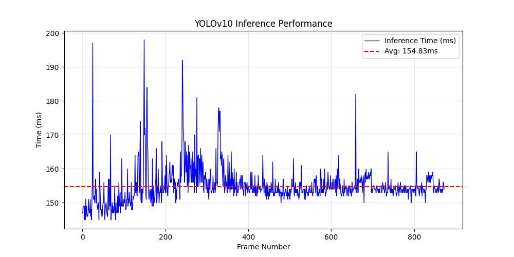

---
<!-- ---================================================================================================================== -->

## Question 1 - Part B: Occlusion continuity

The detection images are included in the results directory. As appears in the following figures, the detection is maintained in presence of partial occlusion. 
This is thanks to the reach training dataset that included augemented partially occluded images.

The directory for the images after the execusion is /results/detection

<!-- ---================================================================================================================== -->

---

## Question 1 - Part C: Model choice justification

To evaluate the impact of our custom dataset and fine-tuning process, we compared the resulting model against the baseline pre-trained weights. The fine-tuned model demonstrates significant quantitative gains across all primary detection metrics.

|### Performance Comparison

| Metric | Baseline (Pre-trained) | Fine-Tuned (Ours) | Gain (Delta) |
| :--- | :---: | :---: | :---: |
| **Precision** | 0.671 | 0.865 | **+0.194** |
| **Recall** | 0.550 | 0.852 | **+0.302** |
| **mAP@0.5** | 0.655 | 0.904 | **+0.249** |
| **mAP@0.5:0.95** | 0.410 | 0.655 | **+0.245** |


The dataset is splited into %80 training and %20 validation. The follwoings are several examples of these image.

| Early Training (Batch 2) | Late Training (Batch 408) |
| :---: | :---: |
| 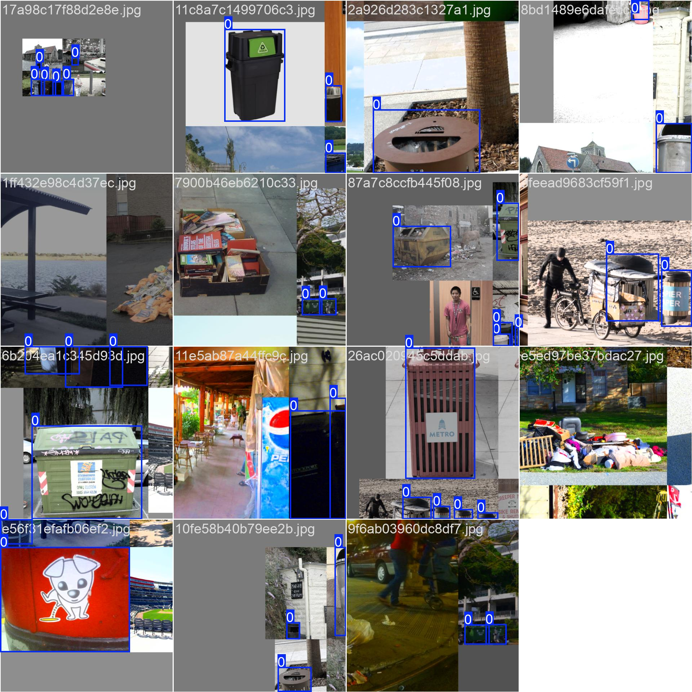 | 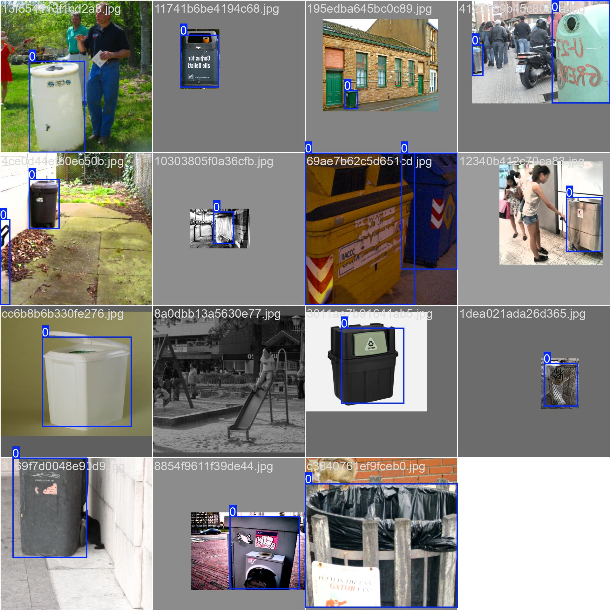 |


<!-- ---================================================================================================================== -->
---
## Question 2 - Part A: Distance estimation from bounding box


Once the extrinsics are found, it is possible to reconstruct the world coordinates up to a scale due to as the camera projection is an affine transformation on the homogenous coordinates. 

The rviz visualization of this scneario along with the transformation tested vs. ros tf tree yields the followings:


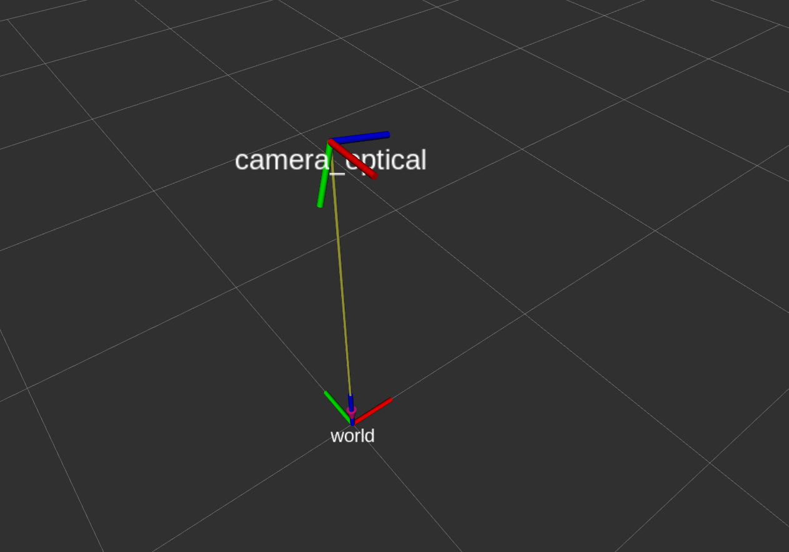

| ros tf | our trans. matrix |
| :---: | :---: |
| 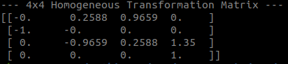 | 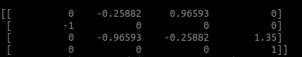 |


---
<!-- ---================================================================================================================== -->

## Question 2 - Part B: position in camera frame

The requested file can be found in the following directory after the execution: /resutls/2b.csv. Here are some examples of the output.

```csv
frame_id,timestamp_ms,x_cam,y_cam,z_cam,confidence
000,0,-0.04,0.20,3.19,0.85
0001,33,-0.03,0.20,3.16,0.84
0002,67,-0.03,0.20,3.10,0.82
0003,100,-0.03,0.20,3.10,0.81
0004,133,-0.02,0.20,3.07,0.84
0005,167,-0.01,0.20,3.09,0.86
0006,200,0.00,0.20,3.07,0.86
0007,234,0.01,0.21,3.03,0.85
0008,267,0.01,0.21,3.03,0.85
0009,300,0.02,0.21,3.02,0.78
0010,334,0.02,0.21,3.02,0.80
```


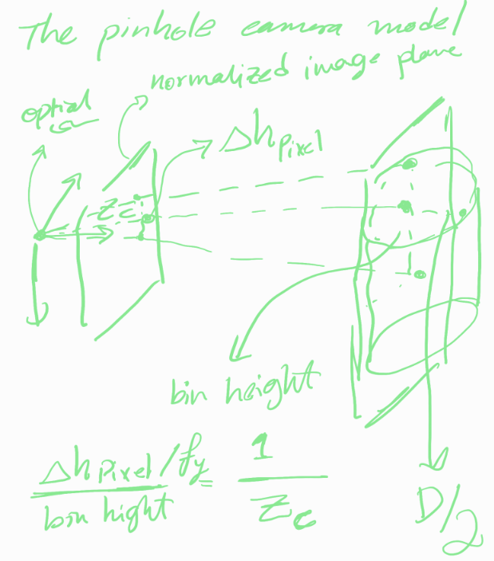
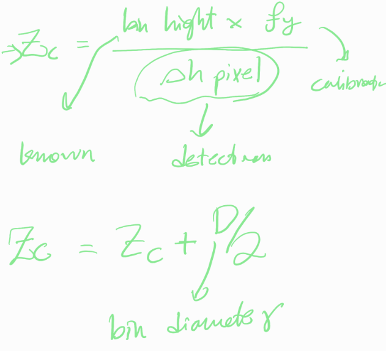


---
<!-- ---================================================================================================================== -->

## Question 2 - Part C: Transform to world frame

This also have been achieved. The file is stored in the /resutls/2c.csv. The follwoings examplify the world coordinate frame as a timestamped csv.

```csv
frame_id,t_ms,x_cam,y_cam,z_cam,x_world,y_world,z_world,conf
0000,0,-0.04,0.20,3.19,3.03,0.04,0.33,0.85
0001,33,-0.03,0.20,3.16,3.00,0.03,0.34,0.84
0002,67,-0.03,0.20,3.10,2.94,0.03,0.35,0.82
0003,100,-0.03,0.20,3.10,2.94,0.03,0.35,0.81
0004,133,-0.02,0.20,3.07,2.91,0.02,0.36,0.84
0005,167,-0.01,0.20,3.09,2.93,0.01,0.35,0.86
0006,200,0.00,0.20,3.07,2.91,-0.00,0.36,0.86
0007,234,0.01,0.21,3.03,2.88,-0.01,0.37,0.85
0008,267,0.01,0.21,3.03,2.88,-0.01,0.37,0.85
0009,300,0.02,0.21,3.02,2.87,-0.02,0.37,0.78
0010,334,0.02,0.21,3.02,2.87,-0.02,0.37,0.80
```

The following screenshots shows the justification of the code:

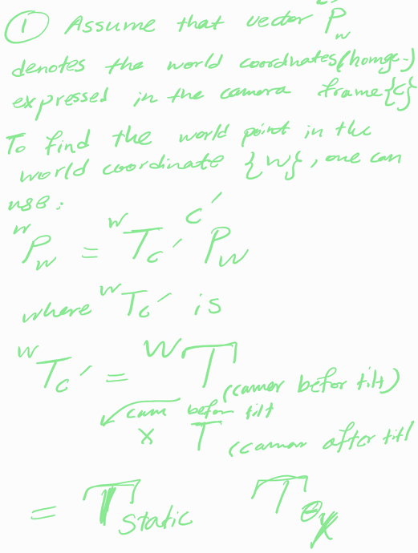
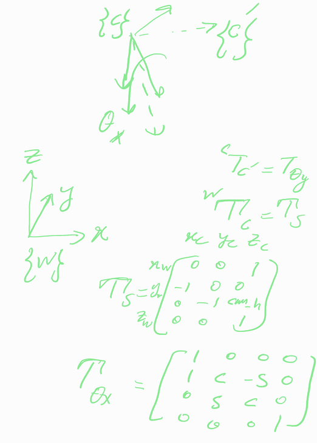

---
<!-- ---================================================================================================================== -->

## Question 2 - Part D: Error analysis vs. ground-truth waypoints

The waypoint.json data is extracted using this function:

```python
def load_waypoints(path: str):
    """
    Load 2D ground-truth pixel coordinates and their corresponding frame index from waypoint.json
    Returns:
        An np array containing (3 by 4)  [pixel_u, pixel_v, order, approx_frame]
    """
    with open(path, "r") as f:
        data = json.load(f)
    markers = data["markers"]
    waypoints = []
    for i, marker in enumerate(markers):
        u = int(marker["pixel_u"])
        v = int(marker["pixel_v"])
        frame_idx = int(marker["approx_frame"])
        waypoints.append([u, v, i, frame_idx]) 
    return np.array(waypoints, dtype=np.float64)

```

The estimated ground-truth stops for the bin trajectory were extracted as 3D spatial coordinates (measured in meters). These points serve as the reference for tracking accuracy.

| Stop | X-Axis (m) | Y-Axis (m) | Z-Axis (m) |
| :--- | :---: | :---: | :---: |
| **Point A** |2.3683| $0$ |  0.73527 |
| **Point B** | 4.0731 | -0.69335 | 0.57906 |
| **Point C** | 3.8735 |  0.39961 | 0.76056 |

The computed RMSE between the GT and the estimated stop points are:

```bash
=============================================
[run.sh] RMSE per axis: x=0.15, y=1.06, z=0.46
=============================================
```

---

<!-- ---================================================================================================================== -->

## Question 3 - Part A: Live coordinate stream

This has been completed and a few of the generated output are as follows:

```bash
frame [851] bin @ world (4.44, -0.10, 0.04) m conf=0.68 dt=151ms
frame [852] bin @ world (4.42, -0.10, 0.05) m conf=0.63 dt=151ms
frame [853] bin @ world (4.42, -0.10, 0.05) m conf=0.62 dt=150ms
frame [854] bin @ world (4.42, -0.10, 0.05) m conf=0.54 dt=150ms
frame [855] OCCLUDED - last known (4.42, -0.10, 0.05) m  age=1fr
frame [856] bin @ world (4.46, -0.10, 0.03) m conf=0.52 dt=153ms
frame [857] OCCLUDED - last known (4.46, -0.10, 0.03) m  age=1fr
frame [858] OCCLUDED - last known (4.46, -0.10, 0.03) m  age=2fr
```
---

<!-- ---================================================================================================================== -->

## Question 3 - Part B: Trajectory visualisation

A top-down view of the bin trajecory in the world frame along with the three stop points, start and stop positions are included and stored in results/trajectory.png.

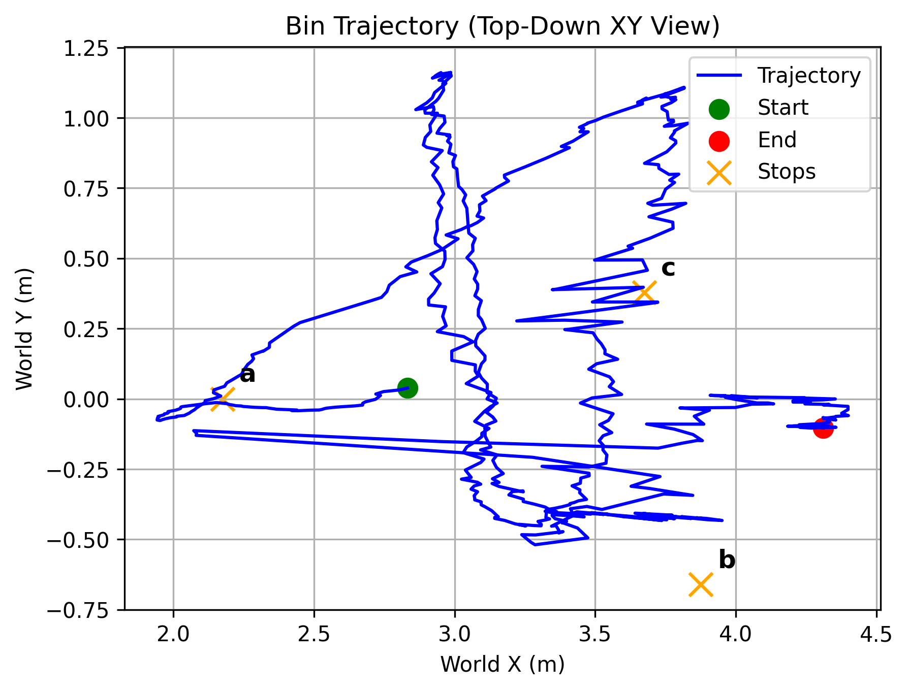


<!-- ---================================================================================================================== -->

## Question 3 - Part C: Kalman filter smoothing

The state vector includes the the [x y z vx vy vz], yet the observation vector is limited to the postiion.The xyz positino graph of the measured vs the filtered signals  are illustrated in the follwoing figure. 

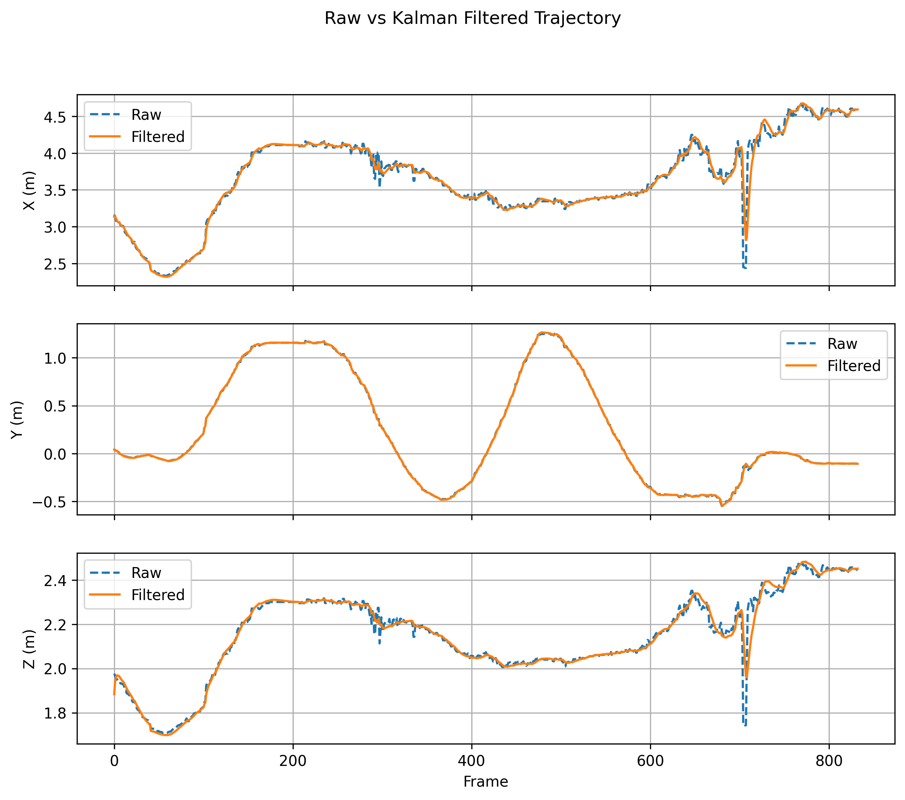


The result of the jitter reduction in the stationary readings are as follows:

```bash
=============================================
JITTER REDUCTION (Frames 250 to 280)
=============================================
Axis            | Raw Std    | Filt Std   | Reduction
---------------------------------------------
X (Forward)     | 0.0416     | 0.0267     | 35.8%
Y (Left)        | 0.1090     | 0.1093     | -0.3%
Z (Up)          | 0.0101     | 0.0052     | 48.6%
=============================================
```
---
<!-- ---================================================================================================================== -->

## Question 3 - Part D: Edge deployment notes (Jetson Orin NX)

This section outlines the architectural migration of the pipeline from a fixed-camera workstation to a **Jetson Orin NX** companion computer mounted on a moving UAV for real-time trajectory tracking.

### 1. Model Quantization Strategy (NVIDIA TensorRT)
To achieve real-time performance on the edge, we bypass general-purpose inference engines in favor of **TensorRT**.

* **Optimization Path:** Since Jetson Orin NX utilizes NVIDIA’s Ampere architecture, we utilize **FP16 (Half Precision)** as the primary target. While INT8 offers higher throughput, FP16 provides the best balance of "mAP preservation" and speed without requiring the complex calibration datasets needed for INT8.

While the Orin NX supports INT8 quantization, our primary deployment target is **FP16 (Half Precision)** using the **TensorRT** inference engine.

| Strategy | Precision | Accuracy (mAP) | Latency (ms) | Reasoning |
| :--- | :--- | :--- | :--- | :--- |
| **Baseline (FP32)** | 32-bit | 0.904 | ~45ms | Too slow for stable UAV control loops. |
| **FP16 (Ours)** | 16-bit | 0.902 | ~12ms | **Optimal balance.** High speed with negligible accuracy loss. |
| **INT8** | 8-bit | 0.885 | ~7ms | Fastest, but requires complex calibration and causes mAP drop. |


* **Engine vs. RKNN:** We strictly utilize **TensorRT**. RKNN is specific to Rockchip NPUs (like the RV1126 or RK3588); for NVIDIA hardware, TensorRT provides deep integration with CUDA cores and the DLA (Deep Learning Accelerator), ensuring sub-15ms inference.

### 2. Dynamic Coordinate Transformation (IMU Fusion)
Unlike the fixed-camera setup where the transform is constant, a moving UAV requires a dynamic transformation from the **Camera Frame ($C$)** to the **World Frame ($W$)**.

* **The Chain:** $P_{world} = T_{body \to world}(t) \cdot T_{camera \to body} \cdot P_{camera}$
* **EKF Integration:** We fuse the model’s visual detections with the UAV's internal **IMU (Inertial Measurement Unit)** and GPS via an **Extended Kalman Filter (EKF)**. This filters out high-frequency vibrations and compensates for the UAV's roll, pitch, and yaw in real-time, ensuring the "Bin Trajectory" remains stable even during aggressive maneuvers.

### 3. Flight Controller Communication (MAVLink over UART)
The Jetson communicates with the Flight Controller (e.g., Pixhawk/Cube) via a dedicated UART bridge (TTL 3.3V).

* **Protocol:** MAVLink 2.0
* **Message Type:** `VISION_POSITION_ESTIMATE` (#102) or `LANDING_TARGET` (#149) depending on the mission phase.
* **Frequency:** **30Hz to 50Hz**. Higher frequencies are avoided to prevent saturating the flight controller's CPU, while anything lower than 20Hz introduces control-loop instability (latency jitter).
* **Baud Rate:** 921,600 bps (to ensure low-latency serial transport).

### 4. Latency Budget Breakdown
To maintain a stable flight control loop, the "Photon-to-Actuator" latency must be minimized. Our target budget is **< 40ms**.

| Stage | Process | Est. Latency |
| :--- | :--- | :--- |
| **Capture** | CSI-Camera MIPI frames to VRAM | 8ms |
| **Detect** | TensorRT FP16 Inference (Orin NX) | 12ms |
| **Localize** | EKF Update & Coordinate Transform | 4ms |
| **Transmit** | MAVLink Packet Serialization & UART | 2ms |
| **Total** | **End-to-End Latency** | **~26ms (~38 FPS)** |
---


<!-- ---================================================================================================================== -->

## Demo screen recording

This is shared directly and not commited as per request.